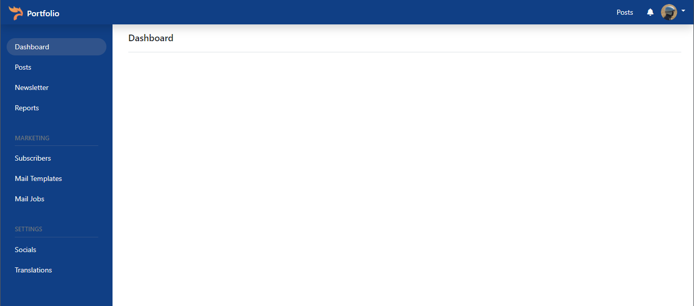

# Pyfolio

Opensource Portfolio application for python developers based on Python 3 & FastAPI framework.



**Features**

- [x] CRUD Categories
- [x] CRUD Posts
- [x] CRUD Subscriptions
- [ ] Send SMTP Mail
  - [ ] Send mail after subscribe, change password, One-time password (OTP), ..etc 
- [ ] Download CV/Resume

## Deploying the App

Click this button to deploy Pyfolio API app to the DigitalOcean App Platform.

[](https://cloud.digitalocean.com/apps/new?repo=https://github.com/ethanvu-dev/pyfolio/tree/main)

## Quickstart

**Pre-requisites:**

- Python 3.8 & Virtualenv
- SQLAlchemy ORM 
- FastAPI framework.
- SQLite database.

#### Step 1: Create virtualenv with python 3.8+

Move to pyfolio directory:

```shell
cd pyfolio
```

Create virtualenv

```shell
virtualenv -p python3.8 venv3.8
```

Active environment

```shell
source venv3.8/bin/activate
```

#### Step 2: Install Python package dependencies

```shell
pip install -r requirements.txt
```

#### Step 3: Start application

Start application in development mode with live reload

```shell
# Move to project root directory
cd pyfolio

# Run application
uvicorn pyfolio.main:app --reload
```

#### Step 4: Verify application 

Open your browser this address: http://127.0.0.1:8000

```json
{"message":"Welcome to Pyfolio!"}
```

#### Step 5: Import sample data

```shell
pyfolio db import --file=example/settings.json
pyfolio db import --file=example/posts.json
```

## Testing

This project use Pytest for run the testing.

Run tests:

```shell
pytest

# OR
make test
```

## Reference

- FastAPI: https://fastapi.tiangolo.com/
- PyTest: https://docs.pytest.org/en/7.1.x/
